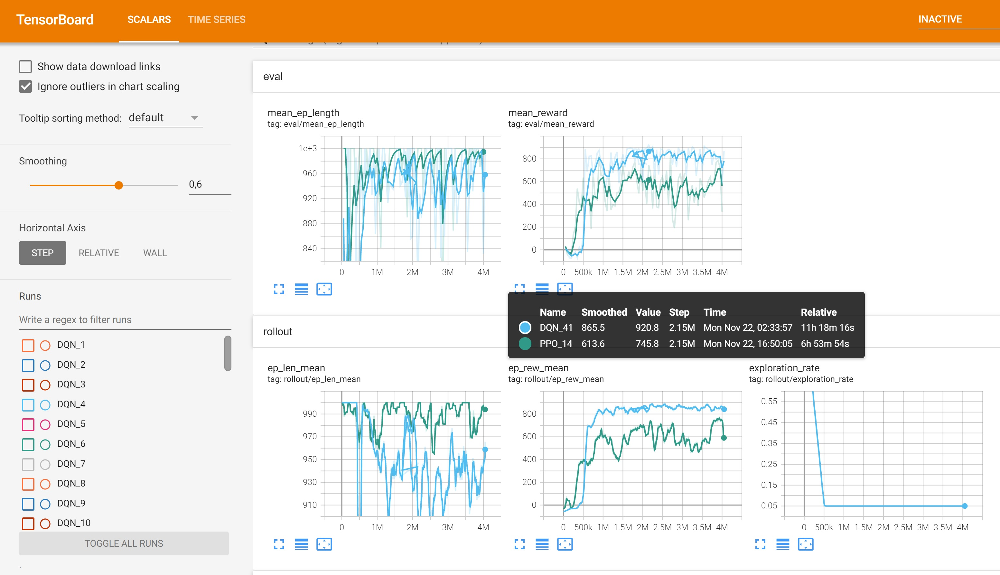

# DeepRL-CarRacing
Short project to compare policy gradient **PPO** and **DQN** methods applied to Car Racing OpenGL problem


## Summary
The project compares the performance and efficiency of PPO algorithm (policy gradient based) with DQN method (deep Q-learning). The target environment was based on OpenAI Gym Car Racing game. The objective is to get 900 reward score which requires the car to stay within the road lines keeping the velocity on some significant level in order to achieve the goal in quite limited timeframe. The implementation is based on **Stable Baselines 3** OpenAI library, which was chosen because of its reliability and the implementations of  reinforcement learning algorithms containing important modifications impacting the results. Writing programs from scratch, i.e. using only some deep learning toolkits like PyTorch or Tensorflow would require to implement these features additionally - like priority buffer or DDQN, etc.

## Installation
Clone the repository and use the Dockerfile to launch the experiment environment container. Originally it has been run on conda, but since there have been some issues with exporting the conda environment to dockerfile and meet all the dependencies correctly (especially with OpenGL), I've decided to setup the environment with pure python 3.8 (no conda). 
Used code snippets from https://github.com/TTitcombe/docker_openai_gym

Steps to build and run docker container:
```
docker build -t rl .
docker run -it rl
```

WARNING: the [script link](scripts/startup_script.sh) could have been converted from Unix(LF) to Windows format during git commit
If it doesn't work, the endlines should be changed (on Windows in notepad++ ```Edit->EOL Conversion->Unix(LF)```
 
## Running the experiments
The provided code includes parametrized option to either train the model, resume/continue training previous best one or test the best saved DQN/PPO model.

**Testing** the **best saved model** for either of the agent types:
```
python rlCarRacing.py --mode test -a agent
```
where ```agent``` is either ```DQN``` or ```PPO```

**Training** of the model
```
python rlCarRacing.py --mode train -a agent
```
where ```agent``` is either ```DQN``` or ```PPO```. Tensorboard log files are automatically saved in ```./Training/Logs``` directory and corresponding models in ```./Training/Saved_Models```.

**Resume training** of the previous model
```
python rlCarRacing.py --mode resume -a agent
```
where ```agent``` is either ```DQN``` or ```PPO```. By default the program loads the best model saved at default ```./Training/Saved_Models``` path for either of the agents.

The running procedure can be further parametrized with various command line arguments available after displaying standard help. For simplicity it's omitted from the description and was mostly used for my experiments. 

## Environment
OpenAI Gym Car racing environment features both continous observation world formed of color pixels and continuous action space. PPO policy based method allows to perform continuous action, but DQN (which can fit image observation spaces better) only allows discrete actions. This requires discretization of continuous action space into separate 4-11 discrete action options. The performed experiments included combination of different number of these. Moreover, higher resolution color action space requires bigger convolutional neural networks for policy/action values modelling which also determined decision to apply **environment wrappers** provided by OpenAI Gym library. The resolution has been lowered to either **84x84** or **42x42 grayscale pixels**. This allows for the use of a **stack of 4-8 consecutive frames** depending on selected experiment setup.

## Results

**All the tensorboard logs** are saved in [Log folder link](Training/Logs) folder. 
**The saved models** are stored in [Models folder link](Training/Saved_Models) folder. 
**The output videos from 10 episodes of last run tests of best model (in this case DQN)** are saved in [Video link](monitor/) folder.

The best model has achieved score of 925:


The experiments including various types of observation and action spaces were performed on RTX 3070 graphics card (CUDA) using conda environment. They were both high memory and GPU processing time demanding. The test have been performed on both PPO and DQN. PPO used mostly standard continuous observation spaces with environment wrappers while experiments performed with DQN algorithms used various modifications: 
* slight changes of CNN architecture, 
* various replay buffer sizes, 
* different discrete action spaces, etc. 
**The best results** have been achieved by using **DQN network** with **4 stacked consecutive 84x84 grayscale pixels frames** with **discrete action space of 5 actions**. The following tensorboard snapshot captured the training process:



The process shows it took over **11 hours** to generate **mean evaluation reward of 921 points** - the game winning model. Previous experiments with DQN proved that the problem had been probably overtraining and as a result the agent applied too much breaking in some situations. Nevertheless, the car could take every type of curves (even U-turns) almost perfectly with high speeds. It seems that the model had a problem to revert to old states and correct this behaviour. In consecutive experiments I tried reducing the discrete action space, which helped and solved the game in 3 hours less than achieving score of 896 in the case of previous best model.
The training process of DQN networks takes a long time - multiple hours - and usually it's only visible at later stages what's going wrong, which is very time consuming. 

PPO results with on-policy learning seem to be worse than DQN so far. The learning takes quicker, especially the start of it. Probably it's harder to teach policy from consecutive frames all the time comparing to off-policy learning with replay buffer in the case of DQN. 
PPO allows to run a few experiments in parallel but I've had some problems with launching it with stable-baselines library. 

## Summary
There are many configuration options possible in order to both achieve better training efficiency and accuracy. It seems to me that 11 hours is still too long for such a model to train. 

Some of the option might be:
* further simplify the environment by applying some image processing features - e.g. segmentation of the road,
* more advanced environment processing - like applying deep autoencoders, 
* apply some other discretization methods for DQN,
* experimenting with CNN training arguments (using the pre-implemented stable-baselines method limits the configuration options, some are also unclear - like setting up epsilon) 
* testing other RL algorithms - like action-critic methods (however I don't expect this one to be significantly better)

